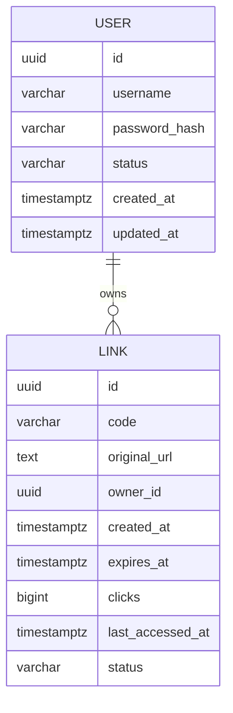

## 📊 Data Model (ER Diagram)

```mermaid
erDiagram
    USER ||--o{ LINK : "owns"

    USER {
        uuid id
        varchar username
        varchar password_hash
        varchar status
        timestamptz created_at
        timestamptz updated_at
    }

    LINK {
        uuid id
        varchar code
        text original_url
        uuid owner_id
        timestamptz created_at
        timestamptz expires_at
        bigint clicks
        timestamptz last_accessed_at
        varchar status
    }
```